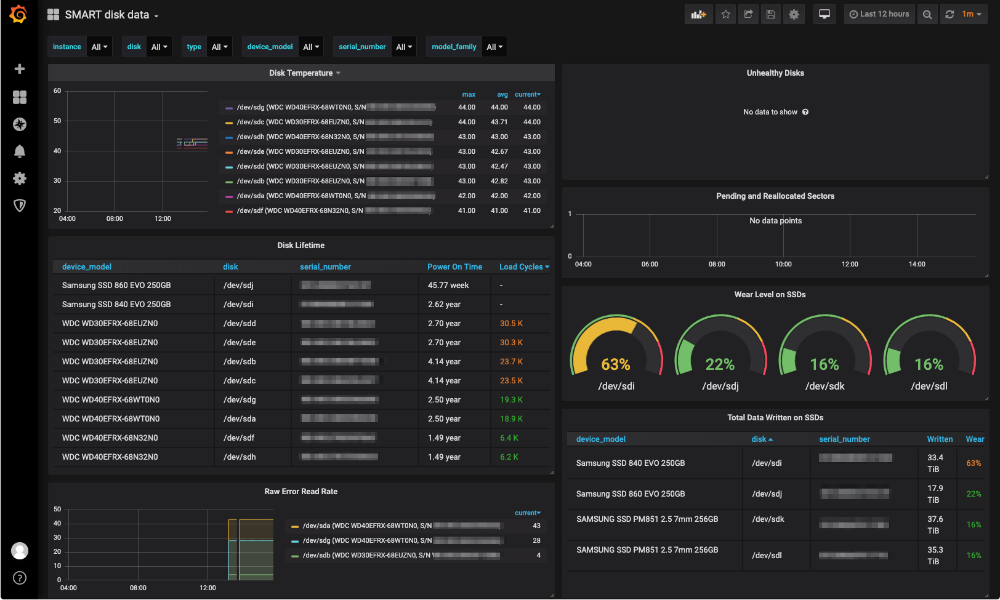

# Text collector example scripts

These scripts are examples to be used with the Node Exporter Textfile
Collector.

To use these scripts, we recommend using a `sponge` to atomically write the output.

   <collector_script> | sponge <output_file>

Sponge comes from [moreutils](https://joeyh.name/code/moreutils/)
* [brew install moreutils](http://brewformulas.org/Moreutil)
* [apt install moreutils](https://packages.debian.org/search?keywords=moreutils)
* [pkg install moreutils](https://www.freshports.org/sysutils/moreutils/)

## Example Usecases

### Grafana Dashboard for smartmon.sh

An exemplary Grafana Dashboard for using the data from `smartmon.sh` is available as id `10664` from the [Grafana Dashboard directory](https://grafana.com/grafana/dashboards/10664).

## Further reading

For more information see:
https://github.com/prometheus/node_exporter#textfile-collector
